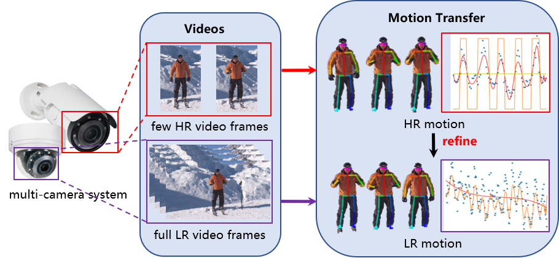

# TSAMT
In this repository we provide code of the paper:
> **TSAMT: Time-Series-Analysis-based Motion Transfer among Multiple Cameras **

> Yaping Zhao, Guanghan Li, Haitian Zheng, Zhongrui Wang

> arxiv link: http://arxiv.org/abs/2109.14174

<p align="center">

</p>

# Usage
1. Identify seasonality with fourier series analysis. Check out `fourier_analysis.py`.
2. Build an addictive time series model;
3. find  periodic  points;
4. extract  addictive  factor;
5. transfer  motion  pattern. 
Step 2-5 are implemented with `utils.py`.

# Citation
```
@article{zhao2021tsamt,
  title={TSAMT: Time-Series-Analysis-based Motion Transfer among Multiple Cameras},
  author={Zhao, Yaping and Li, Guanghan and Wang, Zhongrui},
  journal={arXiv preprint arXiv:2109.14174},
  year={2021}
}
```
